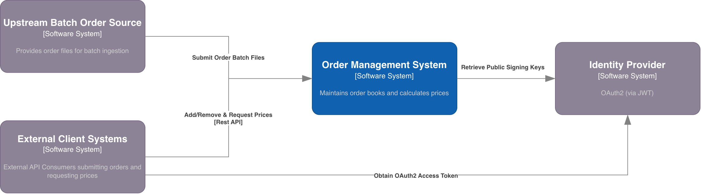
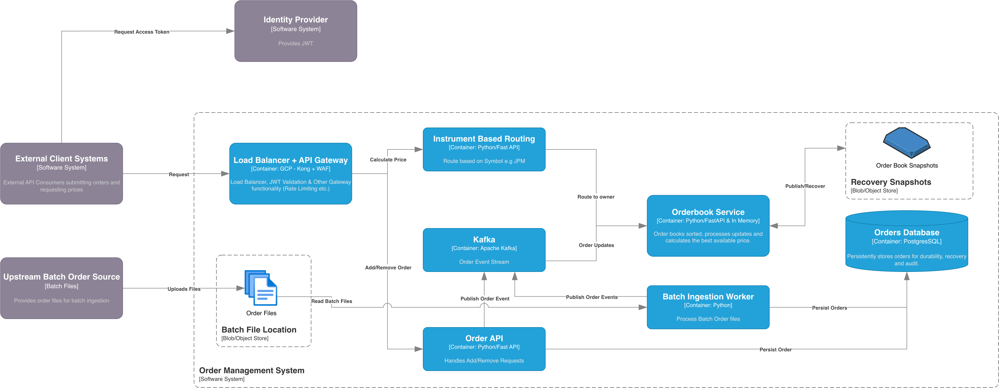
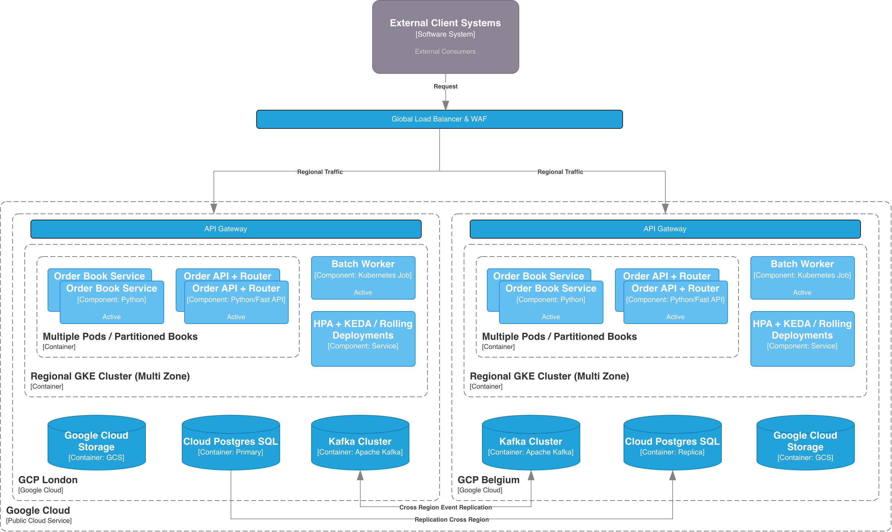

# Order Management System

Part 1 is a small Python/FastAPI application for adding and removing orders and calculating the total price of a requested quantity. Orders live in memory, in separate Buy and Sell books for each instrument. Part 2 contains the architecture and infrastructure design.

Buy pricing takes the **lowest prices first**; Sell pricing takes the **highest prices first**. Quantities are combined across orders and price levels. Calculations are read-only: they neither execute trades nor reduce quantities.

## Run locally

Requires Python 3.13+.

```sh
python3 -m venv .venv
source .venv/bin/activate
pip install -e '.[dev]'
uvicorn order_management.order_api:app --host 127.0.0.1 --port 8000
```

Open [Swagger UI](http://127.0.0.1:8000/docs) or the generated [OpenAPI schema](http://127.0.0.1:8000/openapi.json). Stop the server with Ctrl+C.

The local application uses one process and has no external-service or credential requirements. Restarting clears its orders. Multiple worker processes would have separate books, so use the default single worker. Part 1 has no authentication; run it on loopback. The Part 2 design puts authentication at the gateway.

## API example

```sh
curl -X POST http://127.0.0.1:8000/orders \
  -H 'Content-Type: application/json' \
  -d '{"order_id":1,"symbol":"JPM","side":"Buy","amount":20,"price":20}'

curl -X POST http://127.0.0.1:8000/orders \
  -H 'Content-Type: application/json' \
  -d '{"order_id":4,"symbol":"JPM","side":"Buy","amount":10,"price":21}'

curl -X POST http://127.0.0.1:8000/prices \
  -H 'Content-Type: application/json' \
  -d '{"symbol":"JPM","side":"Buy","amount":22}'
```

The price response is:

```json
{"symbol":"JPM","side":"Buy","amount":22,"total_price":442}
```

Here, `20 × 20 + 2 × 21 = 442`. Repeating the request returns the same total.

```sh
curl http://127.0.0.1:8000/orders/1
curl -X DELETE http://127.0.0.1:8000/orders/1
curl http://127.0.0.1:8000/health
```

| Operation | Result |
| --- | --- |
| Add an order | `201`, with the order |
| Reuse an existing order ID | `409` |
| Retrieve an active order | `200`, with the order |
| Remove an order | `204` |
| Retrieve/remove an unknown or removed ID | `404` |
| Calculate a price | `200`, with the total integer price |
| Insufficient quantity | `409` |
| Invalid JSON contract | `422` |

Order IDs and quantities/prices are integers. Input values are assumed valid; the application does not add business rules for negative values or instrument formats. IDs are unique across instruments within the active book.

## Test data

[Test fixtures](tests/fixtures/README.md) include sample orders, multiple instruments, equal prices, large quantities and duplicate IDs. The tests read these CSV files and add their orders individually through the API or order book. Part 1 exposes the REST operations for adding and removing orders and calculating prices; batch loading belongs to the Part 2 design.

## Code

```text
src/order_management/
  orders.py           Order, side and order errors
  order_book.py       Sorted books and price calculation
  api_models.py       REST request/response contracts
  order_api.py        REST endpoints and app entry point

tests/        Order/API tests, CSV fixtures and a repeatable benchmark
part2-architecture-docs/
  diagrams/   C4 and cloud deployment diagrams
  adr/        Architecture decision records
  infra/      Terraform and Helm charts for the deployment design
```

The book keeps orders in a dictionary by ID and a sorted list of `(price, order_id)` pairs for each symbol and side. Pricing walks the matching list and takes the required quantity from each order. A lock keeps calculations consistent with concurrent updates, and copies prevent callers from changing stored orders directly.

For `N` orders in one symbol/side book, pricing is `O(N)` in the worst case; finding an order by ID is `O(1)`. Adding and removing entries is `O(N)` because Python lists shift elements. The lists stay sorted between updates, so quotes do not need to sort orders again.

## Verification

```sh
pytest -q
ruff check src tests
ruff format --check src tests
mypy src/order_management
```

The tests cover order management, Buy/Sell priority, equal prices, multiple price levels, instrument isolation, large quantities, duplicates, removals, read-only calculations, concurrent updates and API contracts. CSV fixtures, expected-price cases and generated order sets exercise different instruments and quantities.

With a fresh local server running:

```sh
python tests/benchmark.py
```

The benchmark seeds 1,000 orders across 100 price levels, requests all 100,000 units, warms up the HTTP connection, and measures 2,000 sequential pricing calls with a persistent client connection. It reports p50/p95/p99 for the domain and local HTTP round trip, then removes its own orders. Results depend on hardware/load; this does not measure a cloud load balancer, gateway, regional network or concurrent production load.

Measured on Python 3.13.5/macOS arm64, one Uvicorn worker, concurrency one:

| Scope | p50 | p95 | p99 |
| --- | --- | --- | --- |
| Domain calculation | 0.0490 ms | 0.0560 ms | 0.0652 ms |
| Local HTTP round trip | 0.5094 ms | 0.6010 ms | 0.6948 ms |

These local measurements do not demonstrate the Part 2 requirement for a 5 ms API response through the proposed cloud infrastructure.

## Part 2: architecture and deployment configuration

Part 2 describes an OMS deployment across GCP London (`europe-west2`) and Belgium (`europe-west1`). It uses PostgreSQL for persistence, Kafka for order events, partitioned in-memory books for pricing and GCS for batch files and recovery snapshots. The repository includes the architecture diagrams, decision records, Terraform and Helm configuration. The distributed services are a deployment design; their source code and container images are not included.

The system context diagram shows the OMS and its interactions with clients, the batch order source and the identity provider.



The container diagram shows how the API, instrument router, order-book service and batch worker connect to Kafka, PostgreSQL and object storage.



The deployment diagram shows the regional clusters, global ingress, scaling and cross-region replication.



All diagrams are available in the [editable draw.io file](part2-architecture-docs/diagrams/OMS.drawio).

The architecture decision records (ADRs) explain the design choices, alternatives and trade-offs:

- [Persistence and event distribution](part2-architecture-docs/adr/001-persistence-event-driven.md)
- [In-memory pricing and partitioning](part2-architecture-docs/adr/002-in-memory-pricing.md)
- [Batch ingestion](part2-architecture-docs/adr/003-batch-ingestion.md)
- [API exposure and security](part2-architecture-docs/adr/004-api-security.md)
- [Deployment and resilience](part2-architecture-docs/adr/005-deployment-resilience.md)

Terraform defines the cloud resources. The [platform chart](part2-architecture-docs/infra/helm/platform/Chart.yaml) provides the Strimzi and KEDA operators; the [OMS chart](part2-architecture-docs/infra/helm/order-management/Chart.yaml) defines the application workloads, Kong, regional Kafka and replication. Both regions use the same charts with separate values files. See the [infrastructure README](part2-architecture-docs/infra/README.md) for configuration inputs and validation commands.

The infrastructure is a design and has not been deployed. Its validation commands are in the [infrastructure README](part2-architecture-docs/infra/README.md); runtime behaviour and regional failover remain untested.
